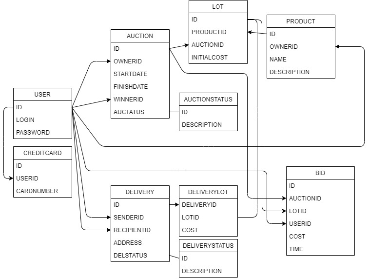

# Задание 1. Аукцион
## Беловицкий Владислав БПИ198

---
## Функциональные требования
Сервис Аукцион-Онлайн должен соответствовать следующим функциональным требованиям:
### 1. Аутентификация пользователя
- регистрация
- вход
### 2. Управление учетной записью пользователя
- добавление информации о пользователе
- добавление данных кредитной карты
### 3. Управление товарами
- создание товара
- редактирование информации о товаре
- добавление изображений товара
- один и тот же товар может участвовать в нескольких аукционах в качестве лота, пока он не будет продан
### 4. Управление аукционами
- создание аукциона
- создание лотов (товаров, участвующих в аукционе)
- администрирование аукциона

----
## Роли пользователей
Пользователь может выполнять определенные действия, в зависимости от его роли в данный момент.
### 1. Продавец
- создание товаров
- создание аукционов
- добавление лотов
- завершение аукциона
- управление доставкой товара
### 2. Покупатель
- выбор аукциона
- возможность сделать ставку на аукционе
- отслеживание доставки

---
## Объектные сущности
Описаны основные сущности (таблицы) сервиса. Для обеспечения реляционных связей в базе данных необходимы дополнительные таблицы.
### 1. Пользователь
- логин
- пароль
- ids кредитных карт
### 2. Товар
- id пользователя (продавца)
- название
- описание
### 3. Аукцион
- id продавца
- дата начала
- дата окончания
- статус
- id победителя
### 4. Лот
- id товара
- id аукциона
- начальная стоимость
### 5. Ставка
- id аукциона 
- id лота
- автор ставки
- сумма ставки
- время ставки
### 6. Доставка
- id продавца
- id покупателя
- ids товаров (в доп. таблице)
- адрес
- статус

## Схема базы данных







