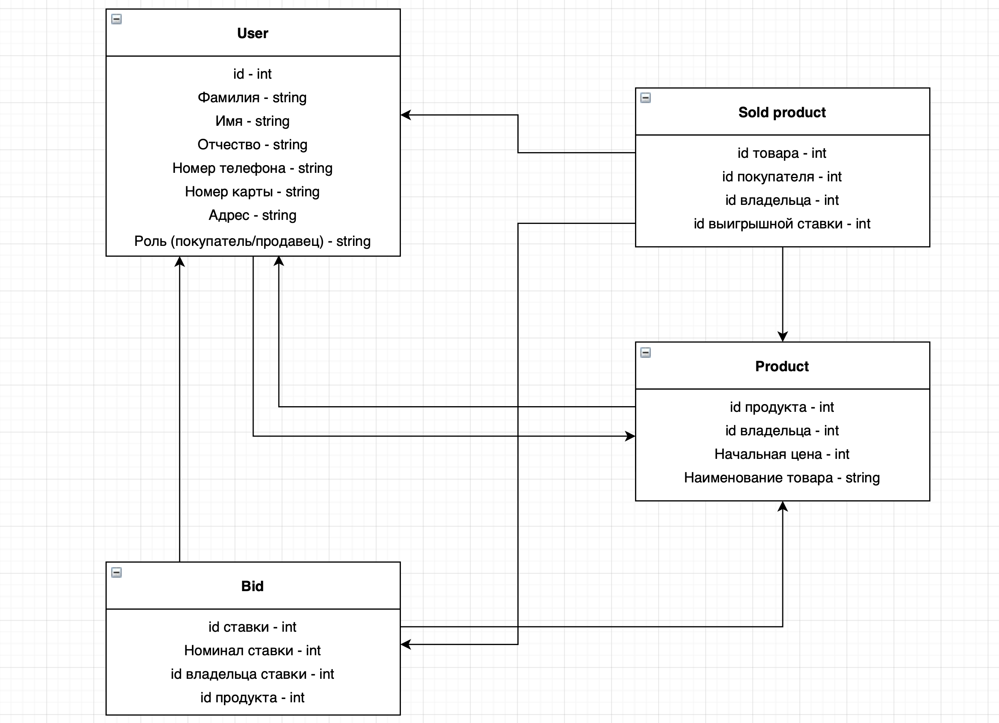

### Список функциональных требований
 * При входе на платформу, а также для дальнейшего взаимодействия с ней, пользователю необходимо быть авторизованным.
 * Авторизованные пользователи могут быть двух видов: продавец и покупатель. ~~(Я понимаю, что в реальной жизни это не логично, но, допустим, тут такая система)~~
 * Авторизованные пользователи типа продавец имеют доступ к возможности выставить свои товары на аукцион с указанием продолжительности и старта торгов.
 * Авторизованные пользователи типа покупатель имеют доступ для участия в торгах, выставлении своих ставок и оплаты купленных товаров.
 * Аукционный товар имеет следующие состояния: на торгах, приобретён.
 * В состоянии "на торгах" у товара должны сохраняться сделанные ставки и их владелец, а также владелец товара.
 * В состоянии "приобретен" у товара должны сохраняться id товара, id владельца, id покупателя, id выигрышной ставки.
 * После завершения торгов, победивший аукционер имеет право отказаться от купли товара. При этом 3 и более отказов в течение календарного месяца приводят к блокировке на аукционе на срок до полугода.

 ### Роли пользователей
 * Неавторизованнный пользователь - слежение за торгами в реальном времени.
 * Авторизованный пользователь - возможность сделать аукционные ставки и продавать свои товары в зависимости от типа авторизации.

 ### Объекты для хранения данных
 * User - пользователь, представляющий из себя покупателя или продавца. Хранит id самого себя, фамилию типа String, имя типа String, отчество типа String, номер телефона типа String, номер банковской карты типа String, адрес типа String, роль (покупатель/продавец) типа String.
 * Bid - ставка. Хранит собственный id типа Int, номинал ставки типа Int, id владельца ставки типа Int, id продукта типа Int.
 * Product - продукт. Содержит в себе общую информацию о товаре: id продукта типа Int, id владельца типа Int, начальная цена типа Int, наименование товара типа String.
 * SoldProduct - проданный товар. Содержит в себе общую информацию о проданном товаре: id продукта типа Int, id владельца типа Int, id покупателя типа Int, id выигрышной ставки типа Int.

 ### Схема обьектной модели и связи между ними
 
