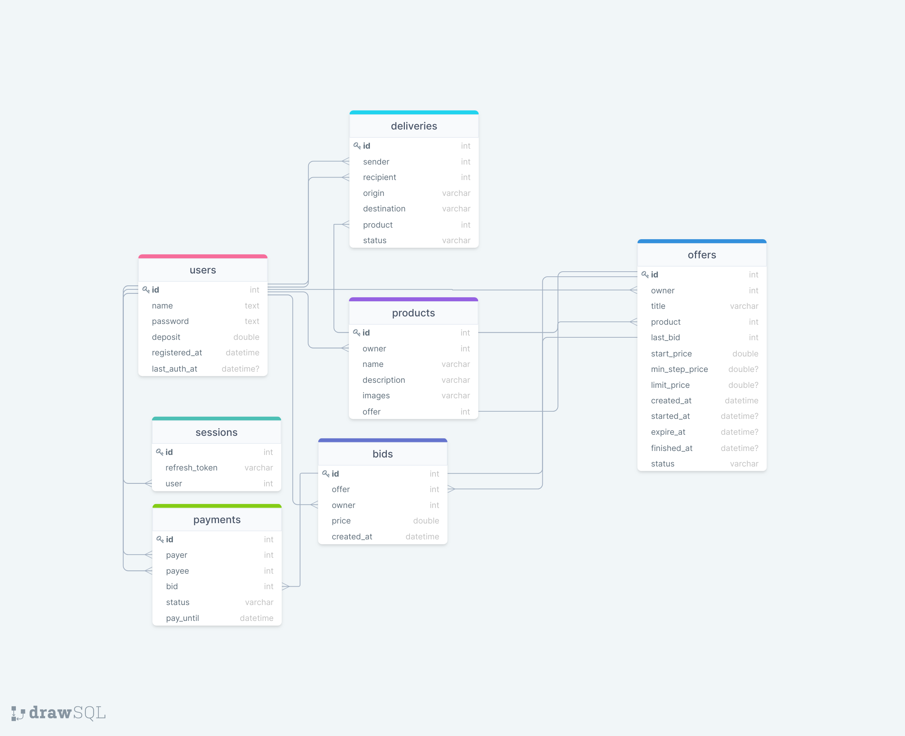

# Дондик Ярослав Задание 1

## Список функциональных требований
Дисклеймер: в задании была указана оплата ставки с помощью кредитной карты, однако вариант с пополнением баланса в проекте мне показался чуть более удачным. Пользователь может поставить ставку не больше, чем пополнил на свой личный счет. Это позволяет резервировать его средства на время актуальности его ставки, а также избежать атаки фейковыми (несерьезными) ставками.

### Пользователи (users)
Каждый пользователь должен иметь возможность:
* Регистрации и авторизации (с применением сессий (sessions))
* Возможность выступать в качестве покупателя и продавца (т.е. иметь возможность как создать товары, так и участвовать в аукционах)
* Возможность пополнить свой баланс/депозит (deposit), с которого будут осуществляться ставки в аукционах
* Возможность выводить деньги со своего баланса
* Возможность размещения "аукционного лота" (offer) и создания "товара" (product) для этого лота
* Возможность оплаты своей "ставки" (bid) в пользу продавца (владельца "аукционного лота")
* Возможность оформления "доставки" (delivery) товара после оплаты "ставки" завершенного аукциона

P.s. разделение ролей происходит только в контексте конкретного аукциона, где один пользователь является продавцом (то есть владельцем аукционного лота), а все остальные - участниками-покупателями. То есть пользователь может создавать свои аукционы и участвовать в аукционах других пользователей.
### Аукционные лоты (offers)
* Аукционный лот содержит в себе информацию о:
    * "товаре" (название, описание, фотографии)
    * дате старта
    * начальной цене аукциона
    * минимальном шаге цены ставки
    * текущей последней ставке 
    * дате "истечения" аукциона (когда аукцион принудительно завершиться)
    * дате завершения аукциона (если аукцион завершен)
* Каждый пользователь-участник аукциона (кроме пользователя-продавца) может разместить свою ставку на аукционный лот до его завершения (но не больше своего свободного баланса (deposit))
* Пользователь-участник аукциона может перебить ставку другого участника путем увеличения своей ставки (учитывая минимальный шаг ставки, если был указан продавцом)
* После завершения аукциона (по дате (expire_at) или по достижению максимальной цены (limit_price), указанной продавцом), пользователь может оплатить свою ставку в течение одних суток, либо вовсе отказаться от оплаты 
* По истечении времени или отказа от оплаты, право покупки товара и оплаты своей ставки переходит пользователю-участнику, разместившему свою ставку перед ставкой последнего пользователя-участника

### Оплата ставок (payments)
* Пользователь-участника аукциона может оплатить свою ставку после завершения аукциона. При этом средства на его балансе/депозите блокируются до момента получения им товара, а после этого переходят на баланс пользователя-продавца
* У "оплаты" есть свой крайний срок, после которого закрывается возможность оплатить ставку (и соответственно купить "товар")

### Доставка (deliveries)
* После завершения аукциона и оплаты последней ставки, пользователь-продавец организует доставку товара, который был ему продан
* После получения товара получателем его заблокированные средства на балансе переходят к продавцу-отправителю

## Объекты

* **users** (Пользователи)
  
  Column | Description
  --- | ---
  `name` | ФИО пользователя
  `password` | пароль в зашифрованном виде
  `deposit` | текущий баланс пользователя
  `registered_at` | дата регистрации пользователя
  `last_auth_at` | дата последней авторизации пользователя

* **sessions** (Сессии)

  Column | Description
  --- | ---
  `user` | пользователь (id)
  `refresh_token` | jwt-токен для обновления пары токенов

* **offers** (Аукционы, лоты)

  Column | Description
  --- | ---
  `owner` | пользователь-продавец (id)
  `title` | название аукциона
  `product` | размещенный на аукционе товар (id)
  `last_bid` | последняя размещенная ставка (id)
  `start_price` | начальная цена лота
  `min_step_price` | минимальный шаг цены ставки
  `limit_price` | скрытый лимит максимальной ставки, после которой завершается аукцион
  `created_at` | дата создания аукциона
  `started_at` | дата начала аукциона
  `expire_at` | дата "истечения" аукциона (т.е. срок завершения аукциона)
  `finished_at` | дата фактического завершения аукциона
  `status` | статус аукциона (scheduled, active, finished, archived, deleted)

* **products** (Товары)

  Column | Description
  --- | ---
  `owner` | пользователь-продавец (id)
  `name` | название товара
  `description` | описание товара
  `images` | изображения товара (url)
  `offer` | аукционный лот (id)

* **bids** (Ставки) 

  Column | Description
  --- | ---
  `offer` | аукцион, к которому сделана данная ставка (id)
  `owner` | пользователь-покупатель (id)
  `price` | цена ставки
  `created_at` | дата создания ставки

* **payments** (Оплаты) 

  Column | Description
    --- | ---
  `payer` | пользователь-плательщик (id)
  `payee` | пользователь-получатель денег (id)
  `bid` | ставка (id)
  `status` | статус оплаты (waiting, approved, declined, expired)
  `pay_until` | крайний срок оплаты

* **deliveries** (Доставки)

  Column | Description
    --- | ---
  `sender` | пользователь-отправитель (id)
  `recepient` | пользователь-получатель (id)
  `origin` | адрес отправления
  `destination` | адрес получения
  `product` | отправляемый товар (id)
  `status` | статус доставки

## Связи
* users
    * products (one to many)
    * offers (one to many)
    * deliveries (one to many)
    * bids (one to many)
    * payments (one to many)
    * sessions (one to many)
    
* offers
    * products (offers.id -> products.offer, one to one) (offers.product -> products.id, many to one)
    * bids (offers.last_bid -> bids.id, one to one) (offers.id -> bids.offer, one to many)
    * users (many to one)
    
* bids
    * users (many to one)
    * payments (one to many)
    * offers (bids.id -> offers.last_bid, one to one) (bids.offer -> offers.id, many to one)

* deliveries
    * users (many to one)
    * products (many to one)

* payments
    * users (many to one)
    * bids (many to one)

## Диаграмма
P.s. Некоторые связи неудачно пересекаются, так что вот [ссылка на онлайн версию схемы](https://drawsql.app/yar/diagrams/task1) (с подсветкой при наведении на связь)

