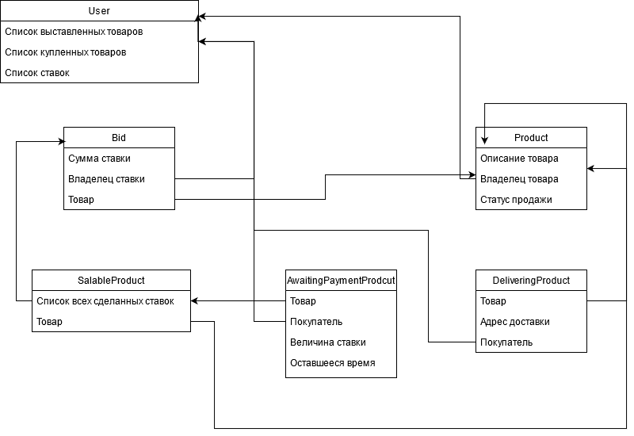

### Список функциональных требований 
* Для взаимодействия с платформой, т.е. чтобы выставлять товары или делать ставки, пользователь должен авторизоваться.
* Каждый пользователь имеет возможность делать ставку на аукционный товар, т.е. уже выставленный, или выстаить свой аукционный товар.
* У пользователя при выставлении товара на аукцион должна быть возможность выбрать время начала торгов и продолжительность торгов.
* У аукцонного товара должно быть 3 состояния: на продаже, ожидает оплаты и доставляется.
* У аукционного товара в состоянии на продаже и ожидает оплаты должны храниться все сделанные ставки, владелец товара.
* У аукционного товара в состоянии доставляется должны присутствовать адрес доставки,предыдущий владелец и покупатель.
* После завершения торгов у последнего пользователя, сделавшего ставку, есть 24 часа на оплату. Если пользовтаель не оплатил, то тоже самое предлагается пользовтаелю с предыдущей ставкой.
* После оплаты пользователь вводит данные для доставки и продавец далее сам занимается доставкой.

### Роли пользователей
* Неавторизованнный пользователь - только просмотр товаров.
* Авторизованный пользователь - покупка и проадажа товаров. Авторизованнный пользователь может выступать в 2 ролях - продавец и покупатель.
* Продавец - тот кто выставил определнный товар, покупатель - тот кто его покупает.

### Объекты для хранения данных
* User - пользователь. Хранит список выставленных ранее товаров, список купленных товаров, список сделанных ставок. 
* Bid - ставка. Хранит сумму ставки, пользователя, товар на который сделана ставка. При этом сумму ставки можно изменить.
* Product - тип, который содержит в себе общую информацию о товаре: описание, фотографии, владельца(User) и статус продажи.
* SalableProduct - товар, который сейчас находится на стадии продажи. Хранит в себе список всех сделанных ставок, отсортированный по величине ставки. При этом для каждого пользователя ставка должна быть только 1, т.е. сумму ставки можно изменить. Также хранит ссылку на товар .
* AwaitngPaymentProduct - товар, который ожидает оплаты. Хранит в себе ссылку на SalableProduct,покупателя, величину ставки и оставшееся для оплаты время.
* DeliveringProduct - товар, который доставляется или уже доставлен. Хранит в себе ссылку на Product, адрес доставки, ссылку на покупателя.

### Схема обьектной модели и связи между ними

