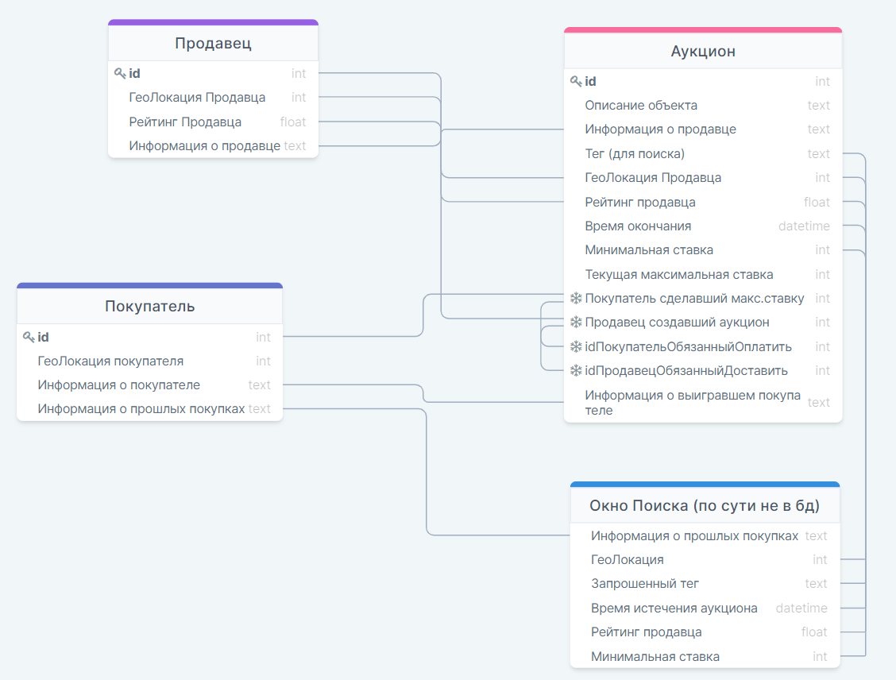

### Practice  #1 DataBases
### Архаров Дмитрий Павлович БПИ198

1. Предложите список функциональных требований для проекта.
	
	- Регистрация в рамках системы в роли покупателя или продавца.
	- Размещение и поддержка цикла жизни каждого аукциона на товар в течении заданного времени размещения ставок.
	- Возможность поставить ставку на аукционе.
	- Определние победителя аукциона и поддержка обязательств по оплате и доставке товара.
	- Стркоа поиска подходящего аукциона, куда пользователь может ввести тег или название продукта, для поиска подходящего ему аукциона.
	- Сортировка предложенных аукционов найденных через поиск по близости локации и/или времени истечения (а ещё минимальной ставке, рейтингу продавца)
	- Система предлагает покупателю подходящие ему аукционы (в виде предложенных вариантов) на основе истории его покупок
	- Система отслеживания рейтинга продавца, можно ли ему доверять, основана на статистике доставленных продуктов(*кол-во успешных доставток*/*кол-во завершённых аукционов*).
	
	
2. Определите роли пользователей и действия для каждой роли.  
    
    Роли: Продавец, Покупатель.
    
	- Продавец создаёт новые аукционы, заполняя информацию о них (время окончания, минимальная ставка, описание продукта, геолокация продавца...).
	- Покупатель делает ставку на аукционе.
	- Покупатель может обращаться к строке поиска вбивая тег или название продукта, для поиска подходящего ему аукциона.
	- После завершения аукциона победитель (покупатель поставивший наивысшую ставку) обязуется оплатить продукт, после - продавец обязуется его доставить.

3. Определите объекты, о которых будут храниться данные.

	- Информация о текущем Аукционе (ниже описано что внутри: информация об объекте text, информация о продавце text, тег(для поиска) text, рейтинг продавца float, время истечения datetime, минимальная ставка int, текущая наивысшая ставка int, покупатель сделавший наивысшую ставку Keyint, обязанный оплатить Keyint, обязанный доставить Keyint, информация о покупателе выигравшем аукцион text (адресс и платёжные средства), геолокация продавца (не знаю какой тип выбрать возможно в виде координат и тогда int, но наверное есть что-то лучше))
	- Информация о продоваемом объекте (text, хранится внутри объекта аукциона)
	- Информация о покупателе для предложения ему привлекательных ему аукционов (list of text (тегов прошлых покупок) внутри объекта покупателя)
	- Информация о покупателе (text, внутри объекта покупателя, например платёжные данные и адресс)
	- Информация о продавце, его надёжности (text, float, внутри объекта продавца, например платёжные данные и адресс)
	- Ставка - это ставит пользователь (int внутри аукциона)
	- Время окончания (переносим пользователя в победителя) - задаёт продавец (datatime внутри аукциона)
	- Описание объекта - продавец (text внутри аукциона)
	- Покупатель, Продавец становящиеся обязанными - система задаёт (Key int, внутри аукциона)
    
	Итоговые абстракции о которых хранятся данные раздельно:  
	--Продавец  
	--Аукцион  
	--Покупатель  
    
4. Определите связи между объектами для хранения данных.  
	Информация о... (и куда она нужна)
    
    - О покупателе - для поиска и предложений.  
	- О продавце - для пользователя и окна предложенных аукционов. 
	- О объекте - для окна аукциона.  
	- О аукционе - в слот для продавца нужна дата о продавце, в слот для покупателя нужен слот покупателя. Для осуществления поиска нужна сортировка по геолокации и тегам.

	По итогу аукциона: покупатель с выигравшей ставкой переносится в слот обязанностей оплаты.  
	А продавец переносится в слот обязанностей по доставке после оплаты, после успешной доставки продавцу засчитывается повышение рейтинга.  

5. Нарисуйте схему объектной модели (используя любые обозначения, которые вам удобны).  
	