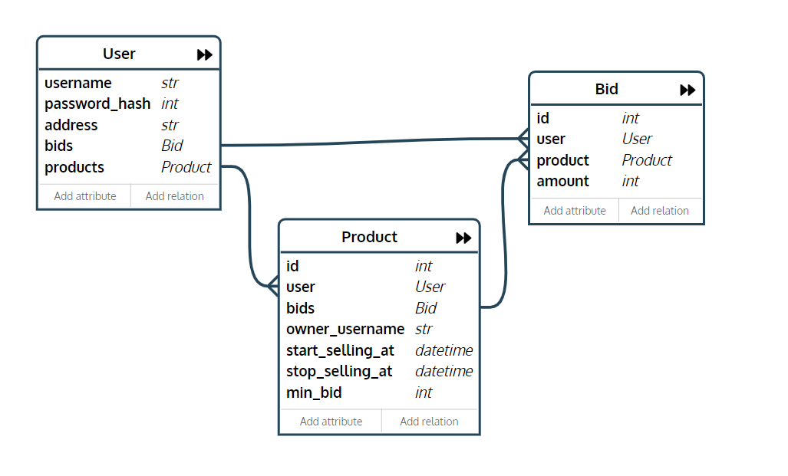

## Функциональные требования
* Регистрация пользователя внутри системы
* При регистрации пользователь указывает уникальный логин, пароль и адрес доставки
* Возможность выставить свой товар на аукцион
* При выставлении товара пользователь указывает время начала и окончания торгов и минимальную ставку
* Возможность делать ставки на выставленные другими пользователями лоты
* Товар отходит пользователю, сделавшему наибольшую ставку к моменту завершения торгов

## Роли пользователей
Неавторизированный пользователь может просматривать открытые на данный момент лоты, а также регистрироваться/авторизироваться в системе.
Авторизированный пользователь может как выставлять товары на продажу, так и покупать их.

## Объекты для хранения данных
* *User* - пользователь системы. Содержит id, адрес доставки, хэш пароля, список товаров во владении, список активных ставок.
* *Product* - выставленный на продажу/купленный товар. Содержит id, указатель на владельца, даты начала и окончания торгов, минимальную ставку, список активных ставок.
* *Bid* - ставка. Содержит id, сумму ставки, указаели на сделавшего ставку пользователя и на продукт, на который сделана ставка.

## Схема объектной модели
 
