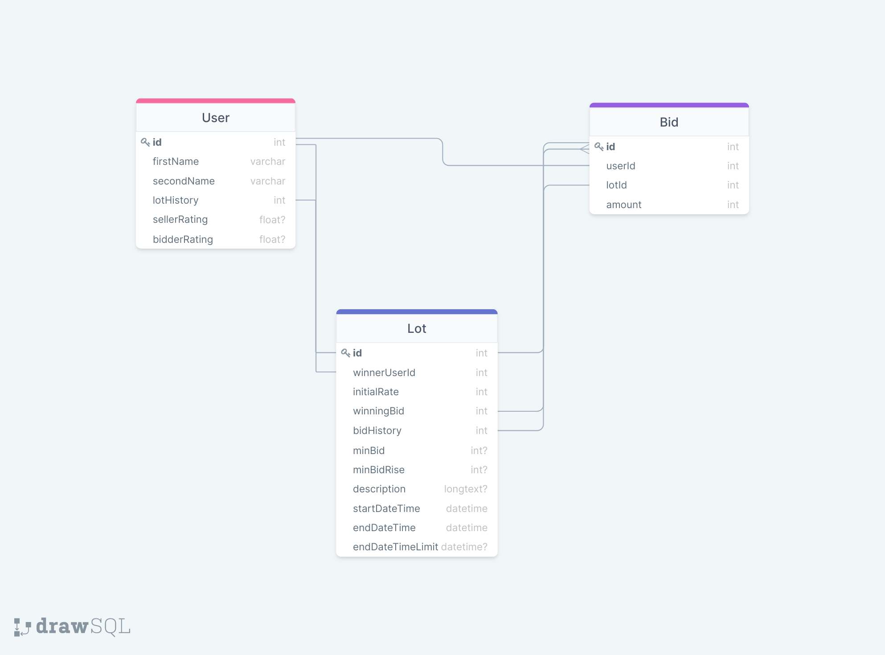

# Практическое задание 1

> Абдельсалам Шади Мазен, БПИ198

## Функциональные требования

Для полноценной работы проект должен предоставлять следующий минимальный набор доступного функционала:

-   Регистрации нового пользователя
-   Аутентификация и авторизация существующих пользователей
-   Регистрация предмета на аукцион со следующими настройками:
    -   Минимальная цена лота
    -   Минимальная цена повышения ставки
    -   Указание характеристик лота
    -   Загрузка фото и видео обзоров товара
    -   Длительность аукциона
-   Участие в торгах с возможностью повышения ставки
-   Оплата выигранного на аукционе лота при помощи интегрированного сервиса для осуществления банковских транзакций
-   Рейтинговая система для пользователей, возможность оценить создателя аукциона и его участников

## Роли пользователей

-   **Неавторизованный пользователь** - имеет возможность просмотра списка существующих лотов, профилей других пользователей, следить за ходом ведения аукциона, но не имеет права участвовать в процессе покупки/продажи.
-   **Авторизованный пользователь** - имеет все те же возможности, что и неавторизованный пользователь, но вдобавок имеет право участвовать в процессе покупи/продажи лотов. В свою очередь неявно делится на:
    -   **Продавец** - пользователь, являющийся основателем аукциона
    -   **Покупатель (потенциальный)** - пользователь, участвующий в покупке лота посредством выставления ставок

## Объекты для хранения данных и связи между ними

Сервис должен хранить данные о следующих объектах (подробнее в схеме объектной модели):

-   Пользователь с личной информацией о нём (имя, фамилия, данные об оплате и т.д.) и историей продаж/покупок
-   Лот с информацией о нём (цена, длительность ведения аукциона, статус и т.д.) и историей ставок пользователей
-   Ставка, относящаяся к определенному пользователю и товару и содержащая сумму

## Схема объектной модели

