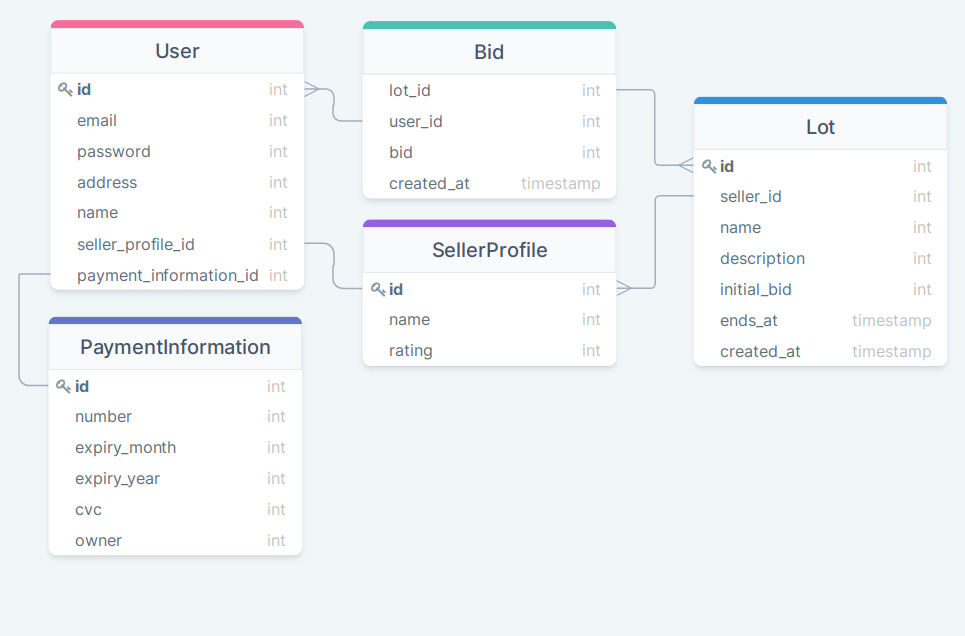

### Задание 1
### Гарифуллин Руслан Ильфатович, БПИ191

#### Список функциональных требований к проекту
 - Возможность получения списка лотов, доступных для продажи (Покупатель, Продавец);
 - Возможность создавать лоты для продажи товаров (Продавец);
 - Возможность сделать новую ставку на товар (Покупатель);
 - Возможность внесения платежных данных пользователя (Покупатель, Продавец);
 - Возможность поставить оценку продавцу (Покупатель);
 - Возможность регистрации и авторизации пользователей с возможностью выбора роли нового пользователя;
 - Возможность получение информации о лоте (товаре) (Покупатель, Продавец);
 - Возможность получения данных о пользователе, отзывов о продавце (Покупатель, Продавец);
 - Возможность получения домашнего адреса пользователя для доставки товара (Продавец);
 - Возможность отката на предыдущую ставку, если покупатель неспособен оплатить товар (Продавец);
 - Возможность модерирования контента платформы и пользователей системы (Модератор).
#### Роли пользователей
 - **Покупатель** - имеет возможность делать ставки, вносить платежные данные для платежа;
 - **Продавец** - может создавать лоты (начинать аукцион), организовывать доставку товаров покупателям;
 - **Модератор** - может удалять, редактировать и модерировать пользователей и содержания страниц для продажи товаров.
#### Объекты (модели) данных
**User**

Хранит данные о пользователях системы (продавцы/покупатели).
 - **id** (int, AUTO INCREMENT) - уникальный идентификатор
 - **email** (text) - адрес электронной почты для рассылки уведомлений и авторизации
 - **password** (text) - пароль (хэш пароля) для авторизации
 - **address** (text) - текстовое представление адреса проживания пользователя
 - **name** (text) - имя пользователя, отображаемая на его профиле
 - **is_moderator** (boolean) - флаг, обозначающий, что пользователь имеет права на модерацию сервиса
 - **seller_profile_id** (int, nullable) - идентификатор профиля продавца (one-to-one SellerProfile), если отсутствует, пользователь - не продавец
 - **payment_information_id** (int) - идентификатор объекта платежных данных (one-to-one PaymentInformation)

**SellerProfile**

Хранит данные о профиле продавца.
 - **id** (int, AUTO INCREMENT) - уникальный идентификатор
 - **name** (text, nullable) - имя продавца/магазина, если отсутствует, используется имя пользователя, которому принадлежит профиль
 - **rating** (float, default 0.0) - рейтинг продавца

**PaymentInformation**

Хранит данные о способах оплаты пользователей.
 - **id** (int, AUTO INCREMENT) - уникальный идентификатор
 - **number** (text) - номер банковской карты
 - **expiry_month** (int) - месяц истечения срока действия банковской карты
 - **expiry_year** (int) - год истечения срока действия банковской карты
 - **cvc** (int) - CVC/CVV код банковской карты
 - **owner** (text) - имя владельца банковской карты

**Lot**

Хранит данных о лотах (товарах) аукциона.
 - **id** (int, AUTO INCREMENT) - уникальный идентификатор
 - **seller_id** (int) - идентификатор продавца, который разместил этот лот
 - **name** (text) - имя товара (лота)
 - **description** (text) - описание лота
 - **initial_bid** (int) - начальная ставка, установленная продавцом
 - **ends_at** (timestamp) - дата окончания аукциона
 - **created_at** (timestamp) - дата создания лота
  
**Bid**
  
Хранит все ставки, когда либо установленных на лотах.
 - **lot_id** (int) - лот, к которому относится ставка (Lot)
 - **user_id** (int) - пользователь, который сделал ставку (User)
 - **bid** (int) - ставка, установленная пользователем
 - **created_at** (timestamp) - дата создания ставки

#### Схема объектной модели

