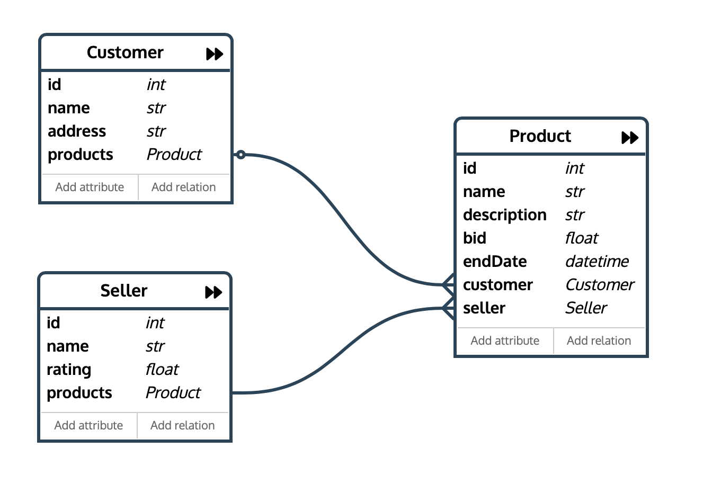

# Дадугин Егор Артемович БПИ198
# Домашнее задание 1

## Функциональные требования

### 1. Должен быть реализован механизм регистрации с выбором роли (покупатель/продавец)

### 2. Пользователям с ролью покупатель должен быть доступен список продавцов, зарегестрированных на платформе

### 3. Пользователям с ролью покупатель должен быть доступен список товаров, выставленных на аукцион

### 4. Пользователям с ролью покупатель должен быть доступен список товаров, выставленных на аукцион, на которые он сделал ставку

### 5. Пользователям с ролью покупатель должен быть доступен список купленных товаров

### 6. Пользователям с ролью покупатель должна быть предоставлена возможность сделать ставку на товар, который был выставлен на продажу

### 7. Пользователям с ролью покупатель должна быть предоставлена возможность просмотреть информацию о текущей ставке на товар, который находится на продаже

### 8. Пользователям с ролью покупатель должна быть предоставлена возможность оценить продавца

### 9. Пользователям с ролью продавец должен быть предоставлен доступ к просмотру профиля покупателя, чья ставка актуальна на данный момент

### 10.  Пользователям с ролью продавец должна быть предоставлена возможность выставлять товар на продажу (задавать описание и начальную ставку)

### 11. Пользователям с ролью администратор должен быть доступен список всех зарегестрированных пользователей и список всех товаров, кторые выставлены на продажу

### 12. Пользователям с ролью администратор должен быть предоставлен доступ для модерации пользователей и списка товаров

### 13. После того, как торги по товару закончены, пользователю-покупателю предоставляется временной интервал для оплаты товара. В случае, если товар не оплачен вовремя он снимается с торгов.

## Роли пользователей

### Пользователь(покупатель) - роль для пользователей, которые хотят осуществлять покупки на сервисе. Участники с данной ролью могут просматривать профили продавцов, просматривать список товаров, делать ставку, оценивать продавцов.

### Пользователь(продавец) - роль для пользователей, которые хотят продавать товары на платформе. Участники с данной ролью могут просматривать профили покупателей, создавать лоты и выставлять их на продажу.

### Администратор - роль для администраторов платформы. Участники с данной ролью могут просматривать все товары и профили пользователей и модерировать их.

## Объекты, о которых хранятся данные, и связи

### 1. Customer - пользователь(покупатель). Хранит id (тип Int), имя (тип String), адрес (тип String). Связан с товарами, на которые данный пользователь поставил.

### 2. Seller - пользователь(продавец). Хранит id (тип Int), имя (тип String), репутация (тип Float). Связан с товарами, которые данный пользователь выставил на продажу.

### 3. Product - товар. Хранит id (тип Int), название (тип String), описание (тип String), ставка (тип Float, изначально равна начальной ставке, далее текущая ставка), время окончания продаж (тип DateTime). Связан с продвацом. Связан с пользователем, сделавшим последнюю ставку. Когда время продажи заканчивается, товар связан с пользователем, который сделал последнюю ставку.

## Схема объектной модели

