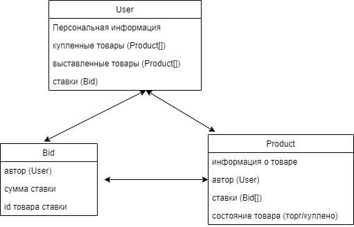

# Список функциональных требований
• Для взаимодействия с платформой пользователь должен иметь возможность зарегистрироваться и авторизоваться.
• Пользователь должен иметь возможность выставить свой товар и принимать ставки
• Пользователь должен иметь возможность делать ставки на чужие товары
• Пользователь должен иметь возможность настраивать правила аукциона (продолжительность, минимальная ставка, шаг ставки)
• Товар аукциона должен иметь несколько состояний (торгуется, ожидание оплаты, приобретен) и сигнализировать об этом
• Товар в состоянии “торгуется” должен хранить в себе и отображать (+- конфиденциально) историю ставок и информацию о них (автор ставки, предложенная цена)
• Товар в состоянии “приобретен” должен хранить в себе и отображать итогового покупателя и цену сделки.
• После завершения торгов, выигрывший пользователь должен иметь возможность оплатить товар
• После оплаты пользователь должен иметь возможность ввода данных для доставки, которые по внутреннему каналу передадутся продавцу.

# Роли пользователей
• Неавторизованнный пользователь – просмотр списка лотов, отслеживание ставок в режиме реального времени без возможности взаимодействия.
• Авторизованнный пользователь может выступать в ролях - продавец и покупатель. Покупатель – возможность участия в торгах, оплаты товара, оформления доставки. Продавец – настройка страницы товара, правил торгов и получения ставок.

# Объекты для хранения данных
• User - пользователь. Хранит информацию о человеке (адрес доставки и тд), список купленных товаров, выставленных на продажу товаров (если таковы имеются), список сделанных ставок.
• Bid - ставка. Хранит сумму ставки, пользователя, товар на который сделана ставка.
• Product - тип, содержащий в себе общую информацию о товаре: описание, фотографию, владельца (изначальный продавец или человек, купивший товар) и статус продажи, массив ставок на товар.

