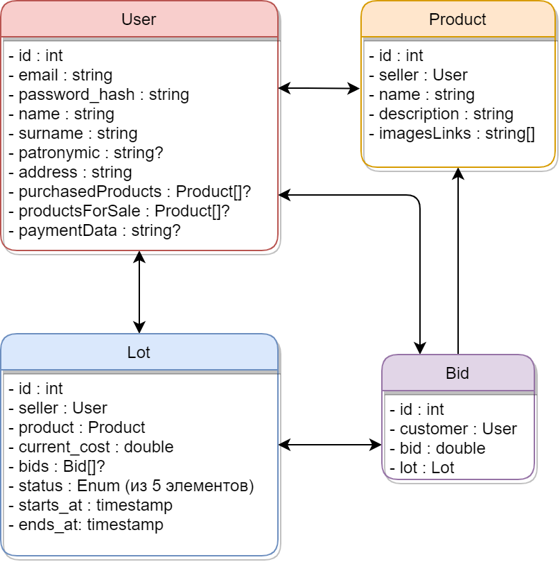

### Функциональные требования
Для реализации онлайн-аукциона предлагается создать платформу, которая будет иметь следующий функционал:
- Регистрация и авторизация пользователей
- Добавление и редактирование личной информации пользователя:
    - ФИО
    - Адрес доставки
    - _другая необходимая информация_
- Добавление и редактирование <a name="product-info">информации</a> о товаре:
    - Название
    - Описание
    - Фотографии товара
    - _другие характеристики_
- Возможность выставить добавленный ранее товар на аукцион с необходимыми данными:
    - Начальная стоимость
    - Шаг ставки
    - Время начала/окончания торгов
    - Время на оплату
- Товары должны иметь следующие статусы, которые отображаются пользователям платформы:
    - Торги ещё не начались
    - В процессе торгов
    - Торги завершились
    - Ожидание оплаты
    - Успешная оплата товара
- Товары, которые купил пользователь должны отображаться в его личном кабинете.
- Товары, находящиеся в состоянии **в процесс торгов** или **торги завершились**, должны хранить информацию о совершенных ставках, с отображением последней ставки на странице торгов.
- Просмотр списка выставленных товаров на аукционе других пользователей, находящихся в статусе **торги ещё не начались** или **в процессе торгов**.
- Просмотр списка своих выставленных товаров, находящихся в в любом статусе.
- Возможность сделать ставку на товар, участвующий в торгах (статус - **в процессе торгов**).
- После завершения торгов, последний пользователь, который успешно сделал ставку, необходимо иметь возможность произвести оплату в указанное продавцом время.
- После успешной оплаты, продавцу должен открыться адрес покупателя, для последующей доставки товара.
- Если покупатель не успел оплатить товар в указанный промежуток времени, то право покупки передается следующему за ним пользователю, который сделал ставку. Он должен также оплатить товар в указанный промежуток времени. Последние три пункта повторяются пока товар не будет успешно оплачен.
- После успешной оплаты статус товара должен переходить в состояние **успешная оплата товара** и далее не отображаться в общем списке товаров на аукционе.

### Роли пользователей
- Неавторизованный пользователь
    - Возможность регистрации и авторизации на платформе
    - Просмотр товаров, находящихся в статусе **торги ещё не начались** или **в процессе торгов**
- Авторизованный пользователь может выступать в следующих ролях (пользователь может одновременно иметь разные роли, по отношению к разным товарам):
    - Покупатель - участие в торгах (+ [весь требующийся функционал для участия](#функциональные-требования))
    - Продавец - выставление товара на торги (+ [весь требующийся функционал для осуществления торгов](#функциональные-требования))

### Объекты для хранения данных
- User - объект для хранения данных для авторизации, личных данных пользователя, списка выставленных/приобретенных товаров (см. Product), списка товаров со сделанной ставкой (см. Bid), где ещё не закончились торги,
- Product - объект для хранения [информации](#функциональные-требования) о товаре.
- Lot - объект для хранения информации о лоте, хранит в себе информацию о товаре (см. Product), продавце (см. User), совершенных ставках (см. Bid).
- Bid - объект для хранения информации о ставке (размер ставки), содержит в себе информацию о пользователе, который сделал ставку. Информацию о лоте (см. Lot).

### Объектная модель
