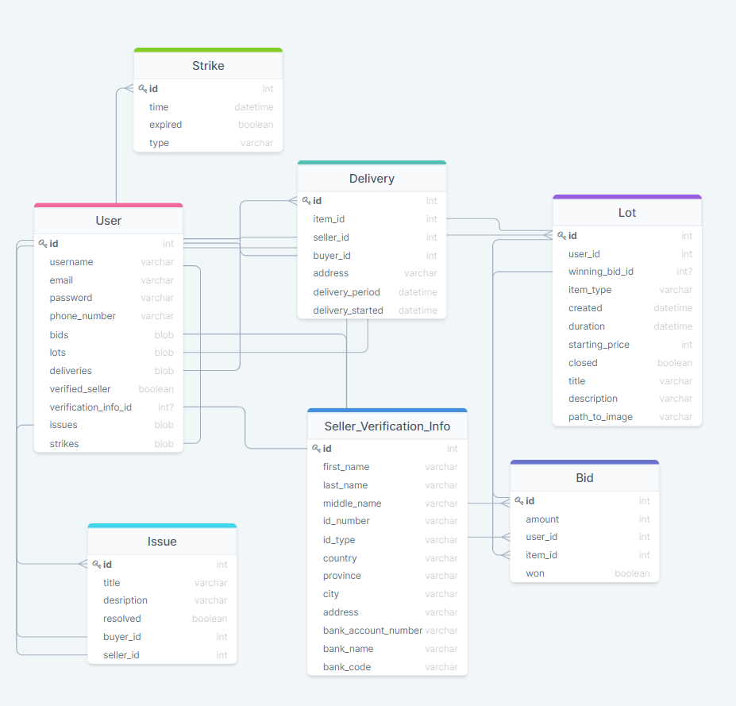

## Задание 1. Аукцион

### Список функциональных требований

- Регистрация и авторизация пользователя по телефону, E-mail и паролю

- Любой пользователь может сделать ставку на уже отрытые лоты, указав цену ставки

- Для того, чтобы создавать лоты, пользователю-продавцу нужно подтвердить свою личность, предоставив идентифицирующую информацию (т.к. на нем лежит ответственность добросовестно доставить товар)

- При создании лотов необходимо указать название, описание, предоставить фотографии и выбрать тип товара. Также можно добавить начальную ставку.

- Для каждого лота записывается дата создания и длительность, а также хранится самая большая ставка. Она обновляется при поступлении новых ставок.

- По завершении торгов пользователь с наибольшей ставкой на данный лот должен заплатить за товар в течении 5 дней. В противном случае ему дается предупреждение (strike). Получение более 3 предупреждений приводит к блокировке аккаунта. Предупреждения исчезают по истечении 1 месяца после нарушения.

- Для оплаты используются сервисы, такие как Qiwi или PayPal и т.д. Также можно использовать кредитную карту. Деньги приходят на банковский аккаунт продавца, указываемый при подтверждении личности. Платежная информация покупателя не хранится для соблюдения приватности.

- После оплаты в аккаунте продавца и покупателя появляется уведомление о доставке, в котором указывается адрес и информация о пользователе (покупателе/продавце). Также устанавливается период доставки.

- Если продавец не доставил товар в указанный срок на него можно составить жалобу (issue). У продавца есть 5 дней, чтобы ответить на жалобу и разрешить проблему, иначе к нему применятся санкции. Жалобу рассмотрят и подтвердят, после чего информация передается в банк, и покупателю возвращают деньги по законам потребителя ((я не юрист и не знаю, что в точности происходит в этом случае, а также в разных странах могут быть разные законы. Так что этот пункт может быть не совсем точным)).

- При совершении продавцом нарушения в зависимости от его серьезности либо аккаунт продавца может блокируется, либо (при задержке товара, например) выдается предупреждение (strike). Получение более 3 предупреждений приводит к блокировке аккаунта. Предупреждения исчезают по истечении 1 месяца после нарушения.
  Роли пользователей

- Покупатель делает ставки, и в случае выигрыша должен оплатить товар.

- Продавец создает лоты, и получает за них оплату. Ответственен за доставку и сохранность товара.

### Объекты для хранения данных

- User

  Пользователь. Хранит телефон, E-mail, пароль, имя пользователя, статус подтверждения продавца и информацию для подтверждения продавца (Seller_Verification_Info). Также массивы ставок (Bid), лотов (Lot), доставок (Delivery), жалоб (Issue), нарушений (Strike).

- Lot

  Лот. Хранит id пользователя, сделавшего ставку, id наибольшей ставки, тип товара, описание, название, дату начала торгов, длительность, начальную ставку, ссылку на картинку и статус (закрыта/открыта)

- Bid

  Ставка. Хранит сумму ставки, id пользователя, id лота и статус (выигрышная/не выигрышная).

- Delivery

  Уведомление о доставке товара. Хранит id лота, id покупателя, id продавца, адрес покупателя, начало доставки, длительность доставки.

- Seller_Verifictaion_Info

  Информация для подтверждения продавца. Хранит ФИО продавца, идентифицирующую информацию о нем, а также банковскую информацию.

- Issue

  Жалоба на продавца. Хранит заголовок, описание, id продавца, id покупателя, статус (разрешена/не разрешена).

- Strike

  Нарушение. Хранит дату нарушения, тип нарушения, статус (истекло/не истекло)

### Схема объектной модели и связи между ними

