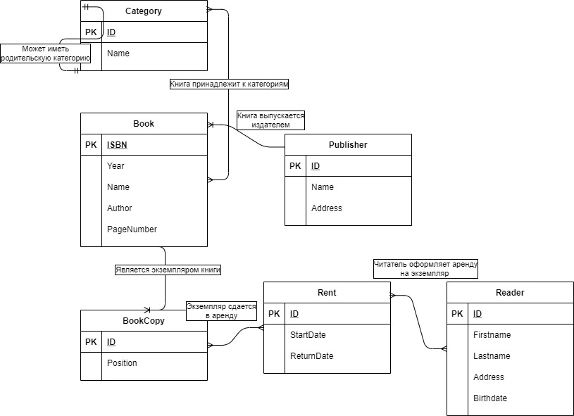
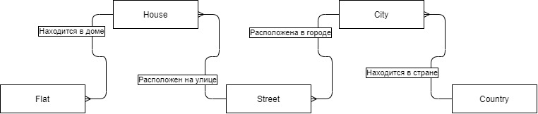
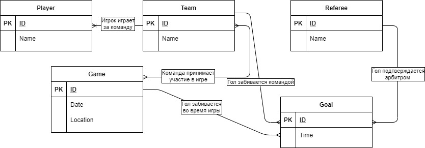

# Задание 2.
## Беловицкий Владислав БПИ198

---

## Задача 1. ER-диаграмма библиотеки


## Задача 2.1.
## ER-диаграмма локаций



## Задача 2.2. ER-диаграммы футбольной игры.
В  первом варианте оперировал сущностями только из задачи, но тогда диаграмма выглядит неполноценно.  


Во втором варианте добавил сущностей и спроектировал более реалистичную ER-диаграмму игры. 


## Задача 3. ???






