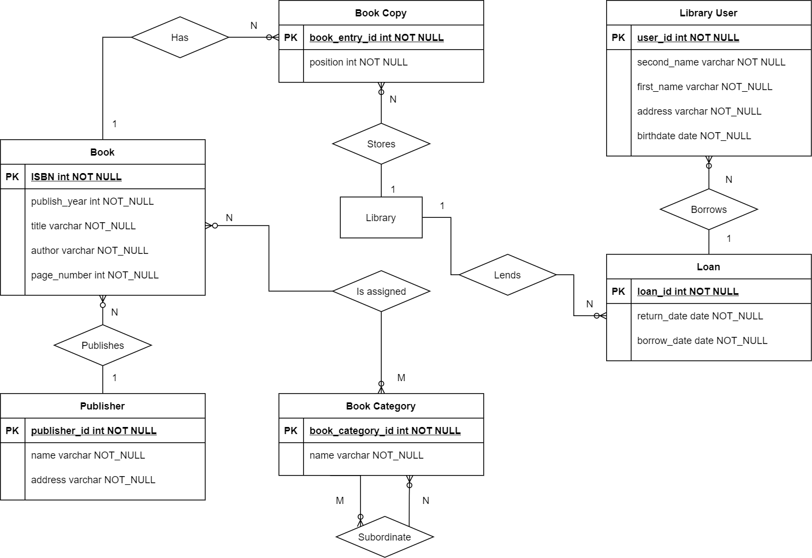
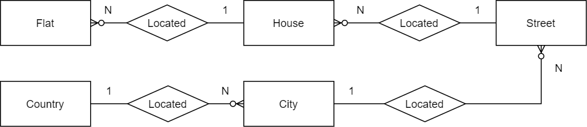
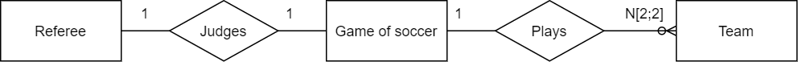
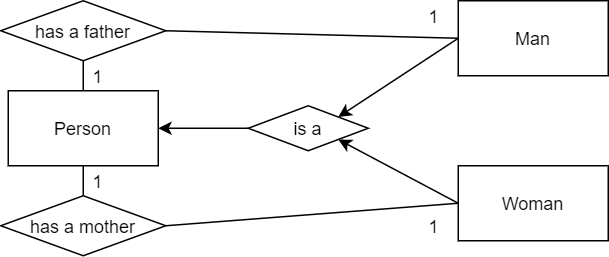
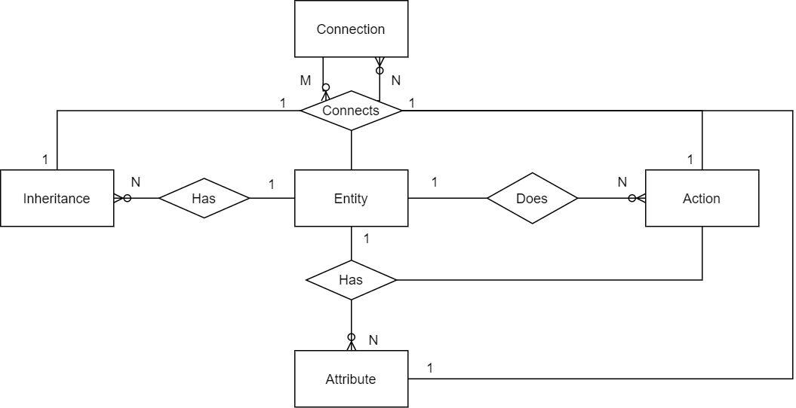

# Практическое задание 1

> Абдельсалам Шади Мазен, БПИ198

## Задание 1
Библиотечная система

## Задание 2
### Пункт 2.1
Связь от квартиры до страны

### Пункт 2.2
Команды и рефери во время футбольного матча

### Пункт 2.3
Родительская свзязь 

## Задание 3
Диаграмма E/R-модели
