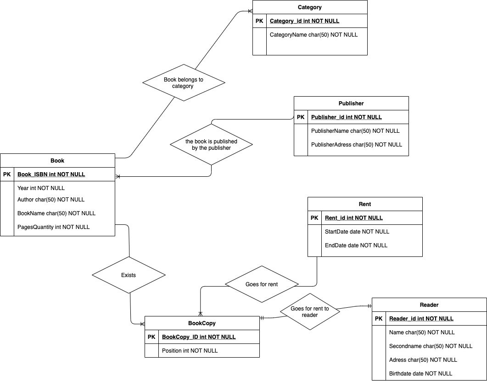
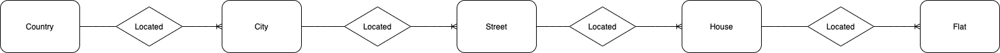
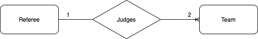

Работу выполнил Бен Мустафа Анас.
(Все связи внутри диаграм разные в зависимости от их сути)

### Задача 1. E/R диаграмма для библиотечной системы на основе требований:
 
 
  ### Задача 2.1. Построить E/R: квартира расположена в доме на улице в городе в стране:
 
 
  ### Задача 2.2. Построить E/R: Две команды играют друг против друга в футбол под руководством арбитра
 
