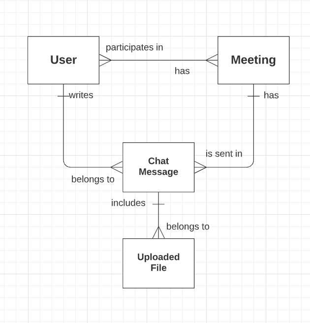

# Гарифуллин Руслан Ильфатович Задание 2
## Задача 1

## Задача 2.1

## Задача 2.2

## Задача 2.3

## Задача 3
Есть система организации видеоконференций. В них есть пользователи, которые могут участвовать во встречах (many-to-many), в рамках встречи возможна отправка сообщений в чат встречи с указанием авторства, к сообщению можно прикреплять (загружать) файлы.

