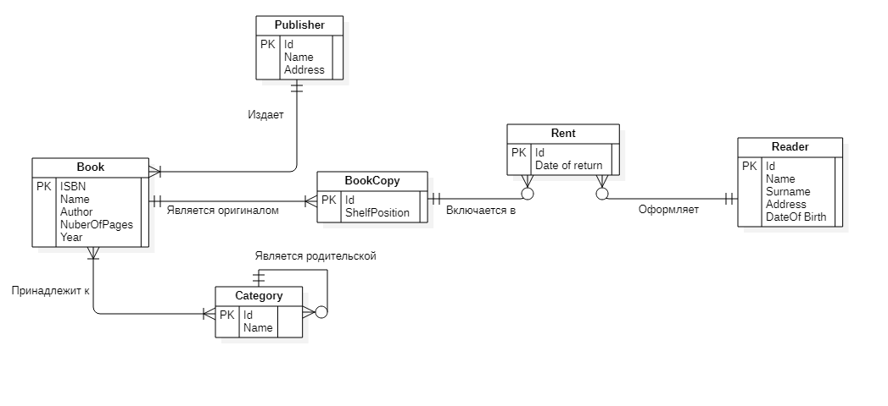
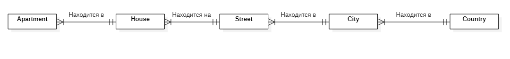
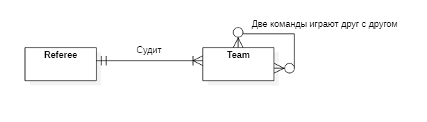
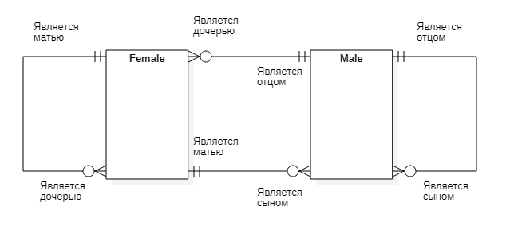
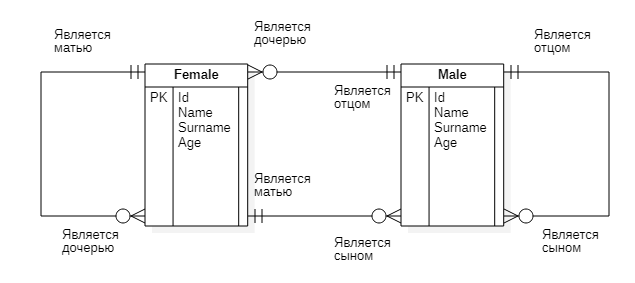
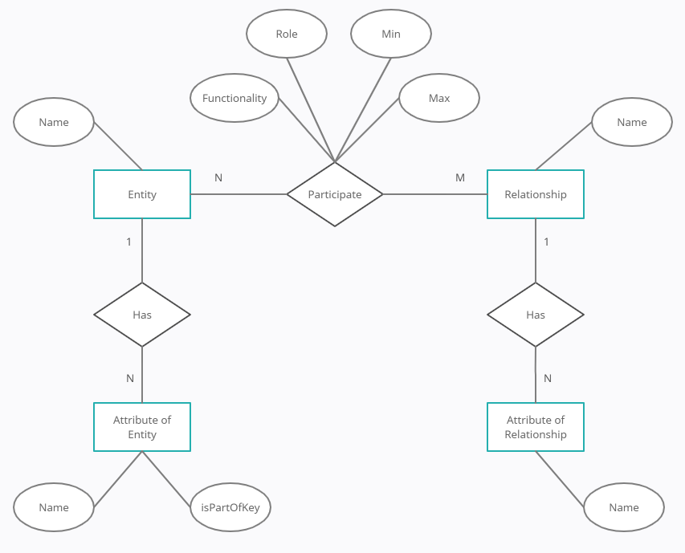

# Дадугин Егор Артемович БПИ198
# Домашнее задание 2

## Задача 1

## Задача 2.1

## Задача 2.2

## Задача 2.3

### Изначально я сделал вот такую диаграмму для сущностей отец, мать, дочь и сын

### Переосмыслив задание, подумал, что это можно сделать двумя сущностями (мужчина и женщина), тогда будет выполняться условие о том, что у КАЖДОГО человека есть отец и мать

## Задача 3

