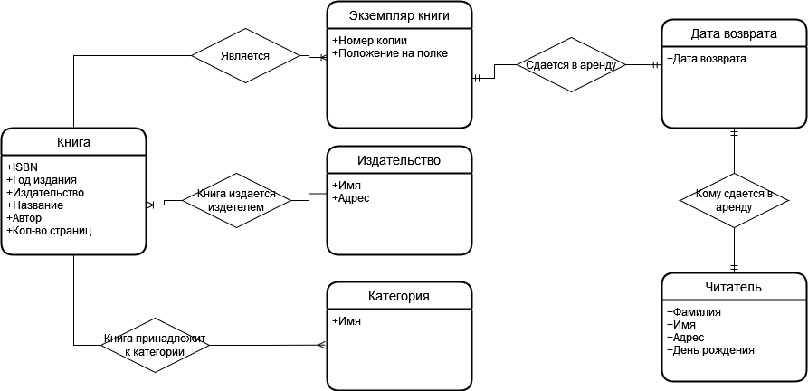
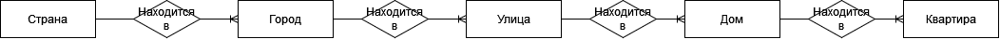
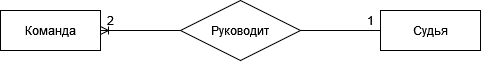
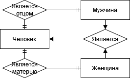
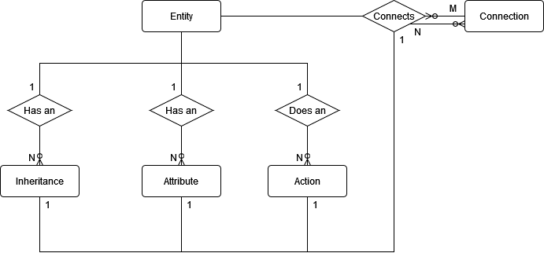

## Задание 1.Нарисуйте E/R диаграмму для библиотечной системы на основе следующих требований

## Задание 2.Смоделируйте следующие отношения в E/R.

### Квартира расположена в доме на улице в городе в стране.

### Квартира расположена в доме на улице в городе в стране

### У каждого человека (мужчины и женщины) есть отец и мать

## Задача 3. Смоделируйте E/R-модель в виде E/R диаграммы.
