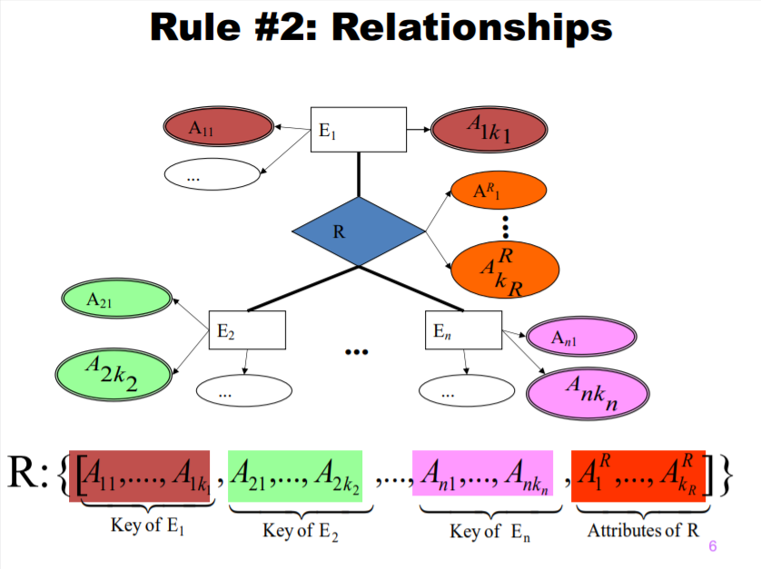
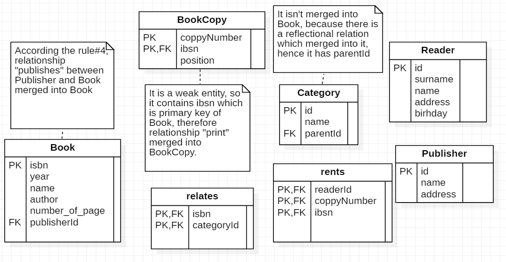
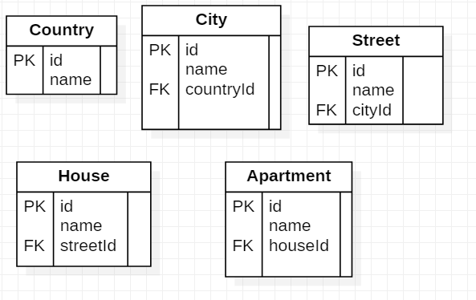
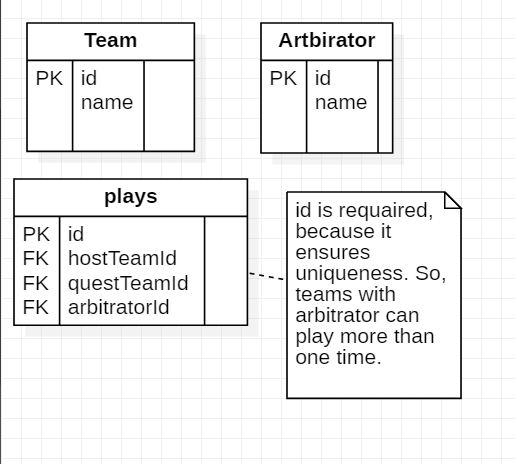
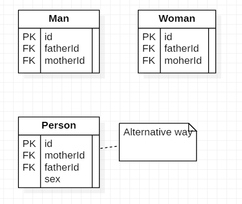
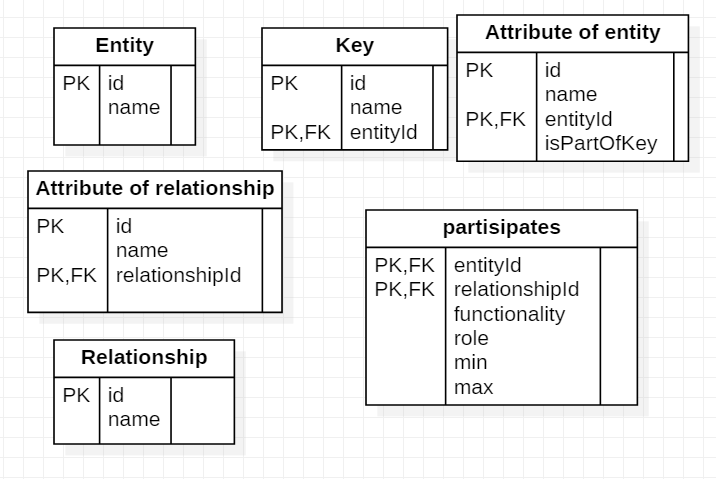
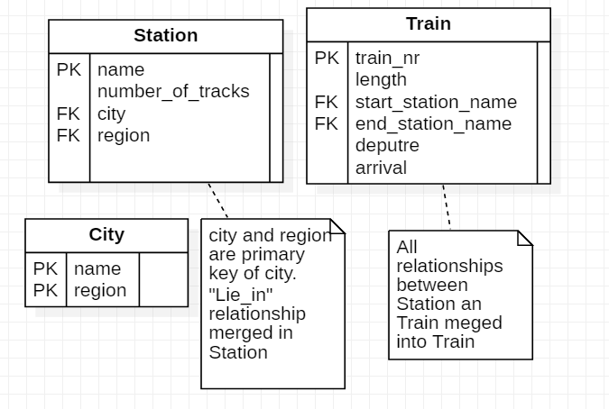
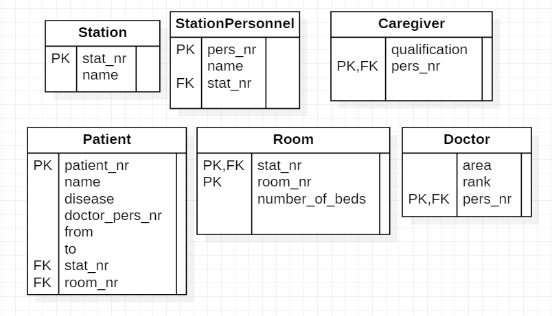

# Bakytbek uulu Nurzhigit, БПИ198
# _Home work 2_

## Task 1

It is can seen from Rule#2 a relationship in relational data model contains keys of entities which are connected with the relationship. At the same time the relationship connects at least one entity. So, any relationship contains at least one key.

## Task 2

### 1

### 2

### 3

### 4

### 5

## Task 3

### 1

### 2

**Thank you!**
