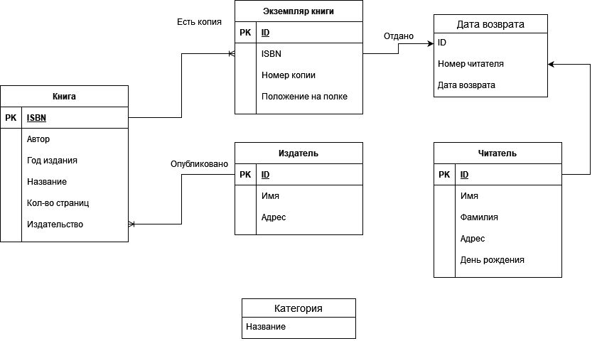

## Task 1
Каждое отношение в реляционной схеме должно иметь хотя бы один ключ, потому что иначе невозможно распознать отношения в схеме.

## Task 2.1

## Task 2.2.1
Квартира расположена в дома, дом находится на улице, улица в городе, город в стране.

Список сущностей:
1. Страна (name_of_country)
2. Город (name_of_country, name_of_city)
3. Улица (name_of_country, name_of_city, name_of_street)
4. Дом (name_of_country, name_of_city, name_of_street, number_of_house)
5. Квартира (name_of_country, name_of_city, name_of_street, number_of_house, number_of_apart)

Связь один к многим:
Страна -> Город находится в (name_of_country, name_of_city)
Город -> Улица находится в (name_of_country, name_of_city, name_of_street)
Улица -> Дом находится на (name_of_country, name_of_city, name_of_street, number_of_house)
Дом -> Квартира находится в (name_of_country, name_of_city, name_of_street, number_of_house, number_of_apart)

## Task 2.2.2
Сущности:
1. Команда (team_num)
2. Арбитр (arbitrator_id)

Связь N:M:1 
Команда -> Команда-> Арбитр (team_num, team_num, arbitrator_id) 

## Task 2.2.3
У каждого человека есть отец и мать.
Сущности
1. Человек (name, sex)

Связи один к многим:
Человек -> Человек является отцом (name_of_father, name_of_child)
Человек -> Человек является матерью (name_of_mother, name_of_child)

## Task 2.3
Сущности:
1. Entity (entity_name, is_weak)
2. Relation (relation_name, is_weak)
3. Attribute (attribute_name, entity_name, relation_name, is_key_part)

Связи один ко многим:
Entity имеет Attribute (entity_name, attribute_name)
Relation имеет attribute (relation_name, attribute_name)

Связь многое ко многим:
Entity -> Relation (entity_name, relation_name)

## Task 3.1
Сущности:
1. City (Region, Name)
2. Station (Name, #Tracks)
3. Train (TrainNr, Length)

Связь один ко многим:
Station -> Train start (Name, TrainNr)
Station -> Train end (Name, TrainNr)
City -> Station lie in (Region, Name (station), Name (city))

Связь 1:1:N:
Station -> Station -> Train connected (Name (1st station), Name (2nd station), TrainNr, Departure, Arrival) 

## Task 3.2
Сущности:
1. Station (StatNr, Name)
2. Room (StatNr, RoomNr, #Beds)
3. Patient (PatientNr, Name, Disease)
4. StationPersonell (PersNr, Name)
5. Caregiver (PersNr, Name, Qualification)
6. Doctor (PersNr, Name, Area, Rank)

Связь один ко многим:
Room -> Patient admission (PatientNr, RoomNr, StatNr, from, to)
Station -> Room has (StatNr, RoomNr, #Beds)
Doctor -> Patient treats (PersNr, PatientNr)
StationPersonell -> Station station (PersNr, StatNr)

