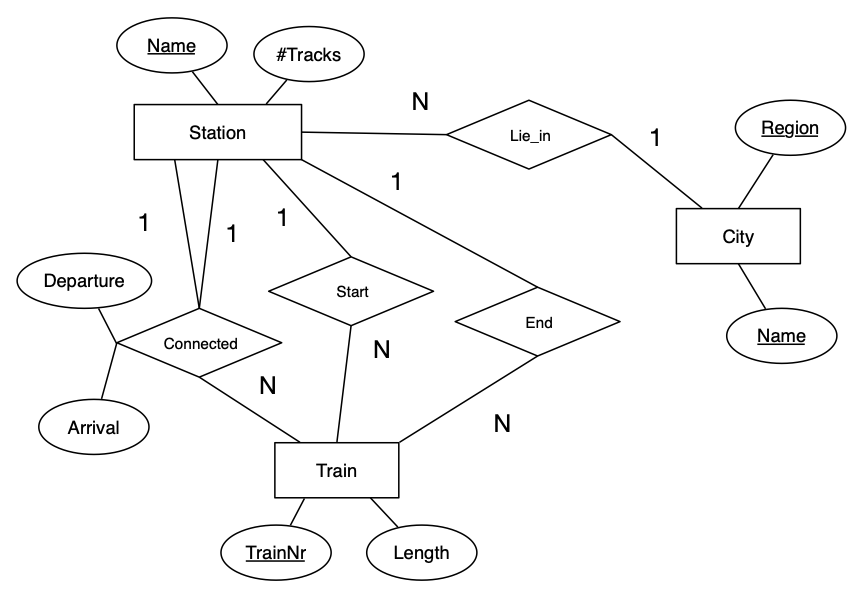

# Практическое задание 3

> Абдельсалам Шади Мазен, БПИ198

## Задание 1
**Вопрос:** Почему любое отношение в реляционной схеме имеет по крайней мере один ключ?

**Ответ:** Ключ является набором атрибутов, позволяет однозначно идентифицировать кортеж отношений. Так как отношение, являющееся множеством кортежей, по определению не может включать в себя одинаковые сущности, то должно существовать множество уникальных атрибутов, являющихся ключом по своей сути.

## Задание 2
### Пункт 2.1

Сущности:
1. Книга {[ **ISBN**, publish_year, title, author, page_number ]}
2. Издатель {[ **name**, address ]}
3. Копия книги {[ **ISBN**, **book_entry_id**, position ]}
4. Пользователь библиотеки {[ **user_id**, second_name, first_name, address, birthdate ]}

Отношения:
1. Бронирование книги {[ **ISBN**, **user_id**, **book_entry_id**, **id**, return_date, borrow_date ]}
2. Категория книги {[ **ISBN**, **name** ]} #В сущности, название категории должно быть уникальным, поэтому может являться ключом

### Пункт 2.2

Сущности:
1. Квартира {[ **flat_number**, **house_number**, **street_name**, **city_name**, **counrty_name** ]}
2. Дом {[ **house_number**, **street_name**, **city_name**, **counrty_name** ]}
3. Улица {[ **street_name**, **city_name**, **counrty_name** ]}
4. Город {[ **city_name**, **counrty_name** ]}
5. Страна {[ **counrty_name** ]}

### Пункт 2.3

Сущности:
1. Команда {[ **team_name** ]}
2. Арбитр {[ **referee_id** ]}

Отношения:
1. Игра {[ **guest_team_id**, **host_team_id**, **referee_id** ]}

### Пункт 2.4

Сущности:
1. Человек {[ **person_id** ]}
2. Мужчина {[ **person_id**, **father_id**, **mother_id** ]}
3. Женщина {[ **person_id**, **father_id**, **mother_id** ]}

Отношения:
1. Человек имеет отца {[ **person_id**, **father_id** ]}
2. Человек имеет мать {[ **person_id**, **mother_id** ]}

## Задание 3
### Пункт 3.1

Сущности:
1. Station {[ **Name**, #Tracks ]}
2. Train {[ **TrainNr**, Length ]}
3. City {[ **Region**, **Name** ]}

Отношения:
1. Connected {[ **TrainNr**, **Arrival**, **Departure**, FromStation, ToStation ]}
2. Lie_in {[ **StationName**, **CityName**, **Region** ]}

### Пункт 3.2

Сущности:
1. StationPersonell {[ **PersNr**, **StatNr** #Name ]}
2. Caregiver {[ **PersNr**, Qualification ]}
3. Doctor {[ **PersNr**, Area, Rank ]}
4. Patient {[ **PatientNr**, Name, Disease, AdmissionFrom, AdmissionTo, RoomNr ]}
5. Room {[ **StationNr**, **RoomNr**, #Beds ]}
6. Station {[ **StatNr**, Name ]}

Отношения:
1. Works_for {[ **PersNr**, **StatNr** ]}
2. Treats {[ **PersNr**, **PatientNr** ]}
3. Admission {[ **PatientNr**, **RoomNr** ]}
4. Has {[ **StatNr**, **RoomNr** ]}