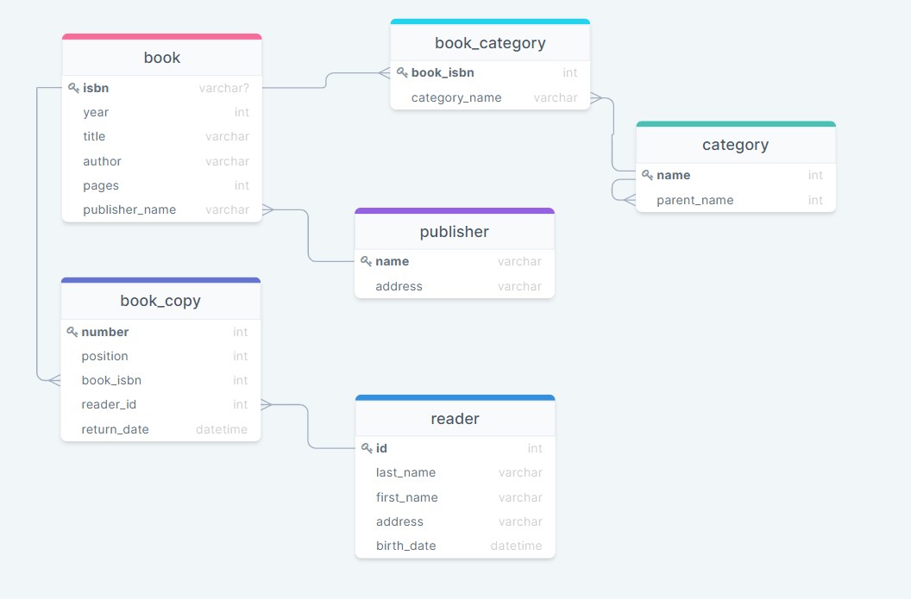
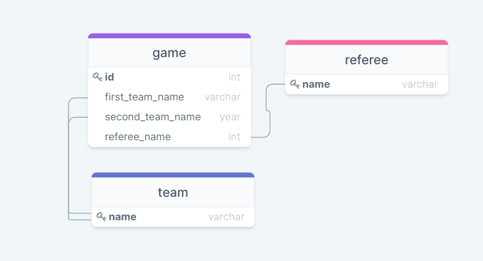
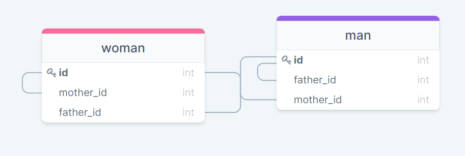

 ## №1
 Ключи служат для идентификации отношений. Каждое отношение имеет хотя бы один ключ, чтобы его можно было идентифицировать.

 ## №2.1
 
 
 ## №2.2.1
 
 
  ## №2.2.2
 
 
  ## №2.2.3
 
 
  ## №2.3
 
  
  
