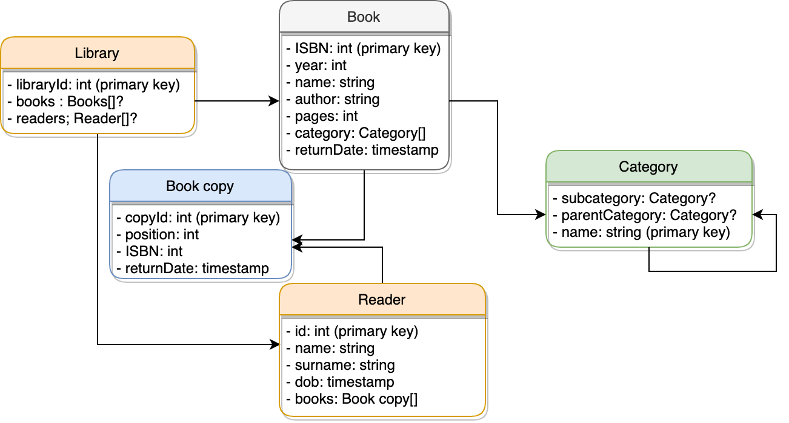
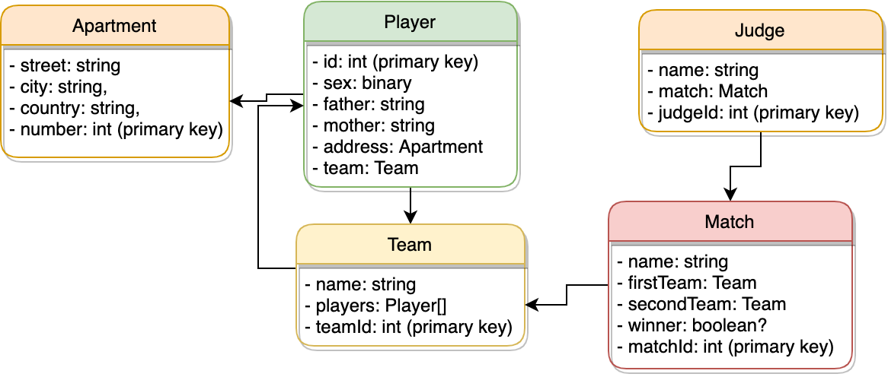
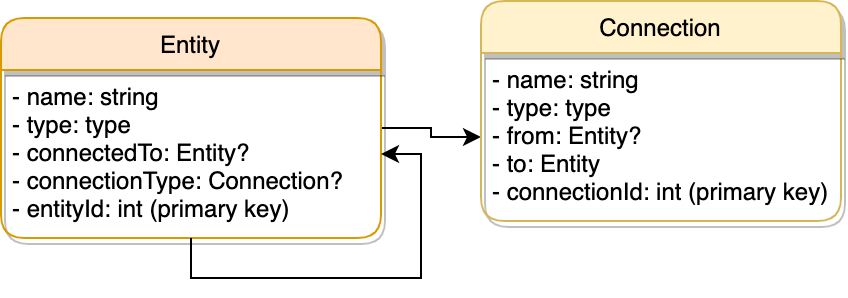

## Задание 1
В реляционных схемах ключи - уникальные, что позволяет решить проблему повторяющихся значений ключей (которых быть не должно), а также однозначно идентифицировать отношение по уникальному ключу.

## Задание 2

## Задание 3
