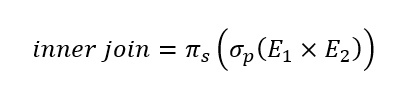
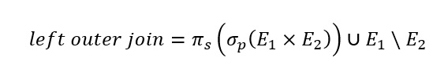

# Задание 4. Шалаева Марина

## Задача 1

Reader (***ID***, LastName, FirstName, Address, BirthDate)

Book (***ISBN***, Title, Author, PagesNum, PubYear, PubName)

Publisher (***PubName***, PubAdress)

Category (***CategoryName***, ParentCat)

Copy (***ISBN, CopyNumber***, ShelfPosition)

Borrowing (***ReaderNr, ISBN, CopyNumber***, ReturnDate)

BookCat (***ISBN, CategoryName***)

### а) Какие фамилии читателей в Москве?

SELECT r.LastName

FROM Reader r

WHERE r.Address = 'Москва';

### б) Какие книги (author, title) брал Иван Иванов?

SELECT b.Author, b.Title

FROM Reader r JOIN Borrowing borrow

ON r.ID = borrow.ReaderNr

BorrowReader JOIN Book b

ON borrow.ISBN = b.ISBN

WHERE r.FirstName = 'Иван' AND r.LastName = 'Иванов';

### в) Какие книги (ISBN) из категории "Горы" не относятся к категории "Путешествия"? Подкатегории не обязательно принимать во внимание!

SELECT bcat.ISBN

FROM BookCat bcat

WHERE bcat.CategoryName = 'Горы' AND

bcat.CategoryName NOT IN 

SELECT DISTINCT bc.ISBN

FROM BookCat bc

WHERE bc.CategoryName != 'Путешествия';

### г) Какие читатели (LastName, FirstName) брали книги, которые были возвращены?

SELECT r.FirstName, r.LastName

FROM Borrowing borrow JOIN Reader r

ON borrow.ReaderNr = r.ID

WHERE borrow.ReturnDate IS NOT NULL;

### д) Какие читатели (LastName, FirstName) брали хотя бы одну книгу, которую брал также Иван Иванов (не включайте Ивана Иванова в результат)?

WITH IvanIvanov AS (SELECT ID

FROM Reader r

WHERE r.Lastname = 'Иванов' AND r.FirstName = 'Иван'),

IvanIvanovBooks AS (SELECT ISBN

FROM Borrowing borrow

WHERE ReaderNr = IvanIvanov),

ReaderNumbers AS (SELECT DISTINCT ReaderNr

FROM Borrowing

WHERE ISBN IN IvanIvanovBooks)

SELECT r.FirstName, r.LastName

FROM Reader r JOIN ReaderNumbers rn

ON r.ID = rn.ReaderNr;

## Задача 2

City (***Name, Region***)

Station (***Name***, #Tracks, CityName, Region) 

Train (***TrainNr***, Length, StartStationName, EndStationName)

Connection (***FromStation***, ToStation, ***TrainNr***, Departure, Arrival)

Предположим, что отношение "Connection" уже содержит транзитивное замыкание. Когда поезд 101 отправляется из Москвы в Санкт-Петербург через Тверь, содержит кортежи для связи Москва->Тверь, Тверь-Санкт-Петербург и Москва->Санкт-Петербург. Сформулируйте следующие запросы в реляционной алгебре:

а) Найдите все прямые рейсы из Москвы в Тверь.

SELECT con.FromStation, con.ToStation, con.TrainNr, con.Departure, con.Arrival

FROM Connection con JOIN Train t ON con.TrainNr = t.TrainNr

WHERE con.FromStation = 'Москва' AND con.ToStation = 'Тверь' AND

t.StartStationName = 'Москва' AND t.EndStationName = 'Тверь';

б) Найдите все многосегментные маршруты, имеющие точно однодневный трансфер из Москвы в Санкт-Петербург (первое отправление и прибытие в конечную точку должны быть в одну и ту же дату). Вы можете применить функцию DAY() к атрибутам Departure и Arrival, чтобы определить дату. 

в) Что изменится в выражениях для а) и б), если отношение "Connection" не содержит дополнительных кортежей для транзитивного замыкания, поэтому многосегментный маршрут Москва-> Тверь-> Санкт-Петербург содержит только кортежи Москва-> Тверь и Тверь-Санкт-Петербург?

## Задача 3

Представьте внешнее объединение (outer join) в виде выражения реляционной алгебры с использованием только базовых операций (select, project, cartesian, rename, union, minus)

inner join = Projection (Selection (E1 Cartesian E2))

left outer join = inner join Union E1 \ E2

right outer join = inner join Union E2 \ E1

