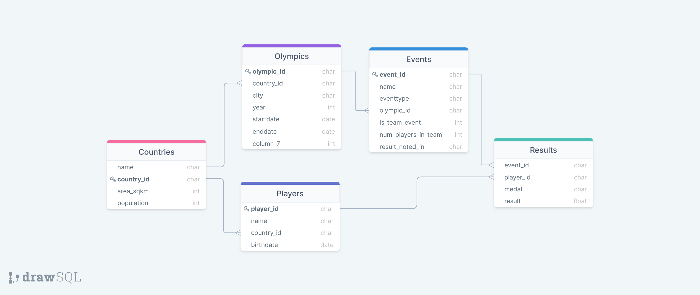

## Задание 6

Установить PostrgeSQL локально. Создать базу данных.

Пример датасета для Oracle (для примера): http://pastebin.com/dEqPSAk3

### Описание дата сета

У спортсмена есть олимпийское удостоверение, имя, пол, страна и дата рождения.
У каждой олимпиады есть год, сезон (летний или зимний), страна, где она проходила, и город.
Каждый спортсмен в базе данных участвует по крайней мере в одной олимпиаде. Спортсмен может участвовать в нескольких соревнованиях на одной Олимпиаде и фактически может участвовать более чем в одной Олимпиаде. Например, Майкл Армстронг участвовал в соревнованиях по плаванию, дайвингу и водному поло. Ян Торп участвовал в летних Олимпийских играх 2000 года в Сиднее и завоевал 3 золотые и 2 серебряные медали. В Афинах 2004 года он завоевал две золотые, одну серебряную и одну бронзовую медали.
У события есть название вида спорта, название события, место проведения, а также запланированное время и дата, какие спортсмены должны были участвовать в соревнованиях, в каких соревнованиях и как они разместились, и кто был победителем (победителями) события (например, какой медалью они были награждены). Вы можете предположить, что нулевые значения используются для победителей и мест размещения до тех пор, пока событие не будет проведено.
Соревнования на Олимпийских играх могут быть как индивидуальными, так и командными. Если это командное мероприятие, мы хотим знать, кто был членом каждой команды.<br/>

### Задание


Напишие SQL запросы

- Для Олимпийских игр 2004 года сгенерируйте список (год рождения, количество игроков, количество золотых медалей), содержащий годы, в которые родились игроки, количество игроков, родившихся в каждый из этих лет, которые выиграли по крайней мере одну золотую медаль, и количество золотых медалей, завоеванных игроками, родившимися в этом году.

```sql
select date_part('year', birthdate) as year, count(DISTINCT r.player_id), count(*)
from players p
         join results r on p.player_id = r.player_id
         join events e on r.event_id = e.event_id
         join olympics o on e.olympic_id = o.olympic_id
where r.medal = 'GOLD'
  and o.year = 2004
group by date_part('year', birthdate);
```

- Перечислите все индивидуальные (не групповые) соревнования, в которых была ничья в счете, и два или более игрока выиграли золотую медаль.

```sql
select e.event_id
from events e
         join results r on e.event_id = r.event_id
where e.is_team_event = 0
  and r.medal = 'GOLD'
group by e.event_id
having count(*) >= 2;
```

- Найдите всех игроков, которые выиграли хотя бы одну медаль (GOLD, SILVER и
  BRONZE) на одной Олимпиаде. (player-name, olympic-id).

```sql
select distinct on (1) p.name, e.olympic_id
from players p
         join results r on p.player_id = r.player_id
         join events e on r.event_id = e.event_id;
```

- В какой стране был наибольший процент игроков (из перечисленных в наборе данных), чьи имена начинались с гласной?

```sql
select c.country_id, name, PercentsTable.percent
from countries c
         join (select FilteredTable.country_id,
                      FilteredTable.filteredCount / NonFilteredTable.nonFilteredCount::float as percent
               from (select country_id, count(*) as filteredCount
                     from players
                     where left(name, 1) in ('I', 'U', 'A', 'O', 'E')
                     group by country_id) as FilteredTable
                        join (select country_id, count(*) as nonFilteredCount
                              from players
                              group by country_id) as NonFilteredTable
                             on FilteredTable.country_id = NonFilteredTable.country_id) PercentsTable
              on PercentsTable.country_id = c.country_id
order by PercentsTable.percent desc
limit 10;
```

- Для Олимпийских игр 2000 года найдите 5 стран с минимальным соотношением количества групповых медалей к численности населения.

```sql
select c.name
from results r
         join players p on r.player_id = p.player_id
         join events e on r.event_id = e.event_id
         join olympics o on o.olympic_id = e.olympic_id
         join countries c on p.country_id = c.country_id
where o.year = 2000
  and e.is_team_event = 1
group by c.name, c.population
order by count(*) :: decimal / c.population
limit 5;
```
