# API

### Создание сущности Reader

Отправить POST запрос на http://localhost:8080/readers c телом

```json
{
    "name" : "Emir",
    "surname" : "Aparov",
    "address" : "Moscow",
    "birthday" : "2001-09-11"
}
```
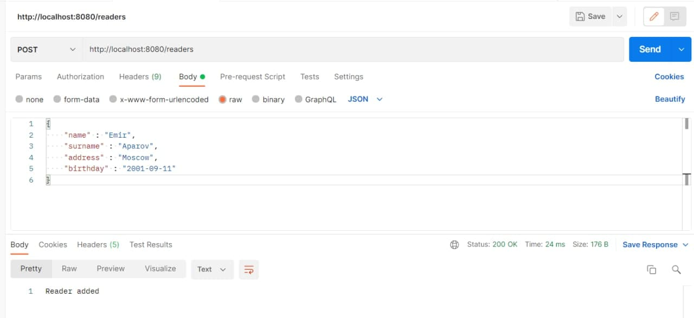

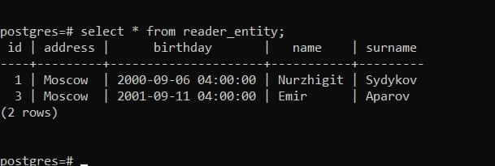


### Редактирование сущности Reader

Отправляем PUT запрос на http://localhost:8080/readers с телом

```json
{
    "id" : 3,
    "name" : "Emirbek",
    "surname" : "Aparov",
    "address" : "Moscow",
    "birthday" : "2001-09-11"
}
```

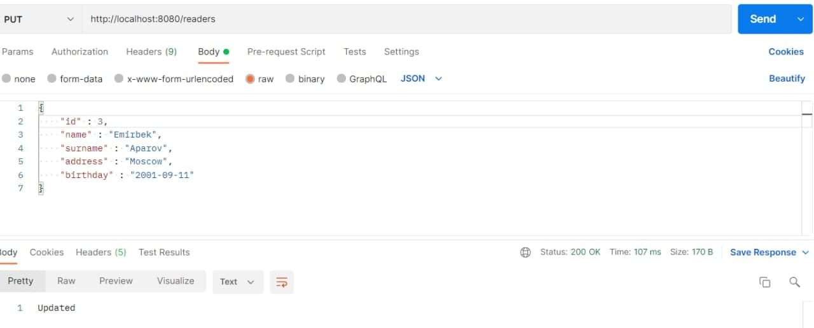

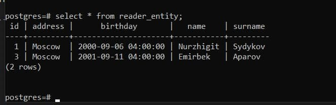

P.S Нужно посмотреть какой id дал СУБД и подставить в значение ID, у меня в данном сдучае id = 3.

### Чтение сущности Reader

Отправляем GET запрос на http://localhost:8080/readers/3, где последнее число - id читателя.

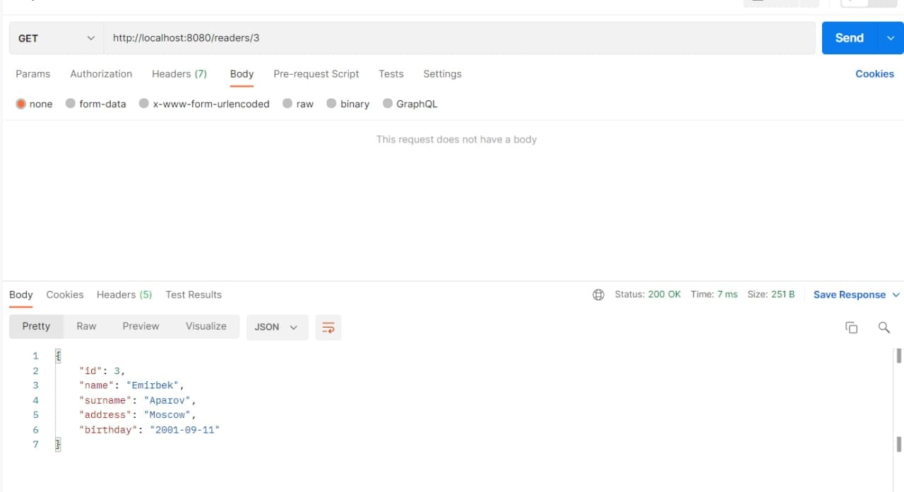

### Удаление сущности Reader

Отправляем DELETE запрос на http://localhost:8080/readers/3, где последнее число - id читателя.

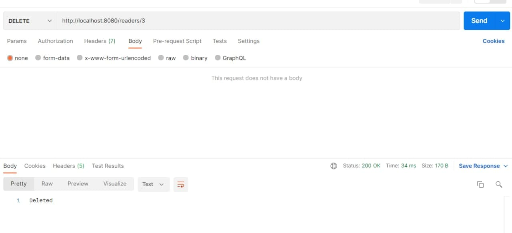

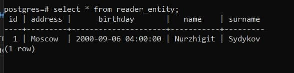

### BookCopy

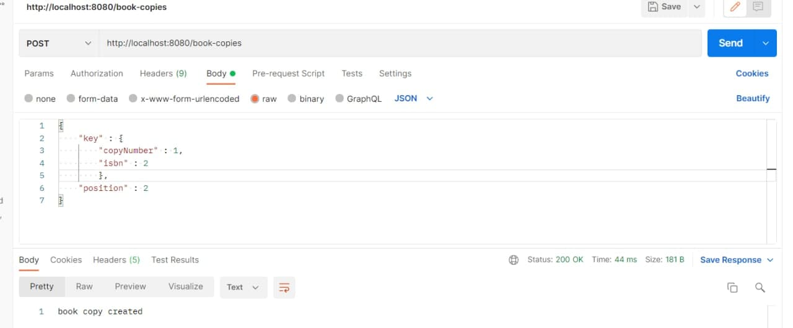

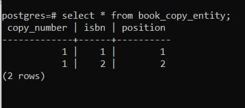

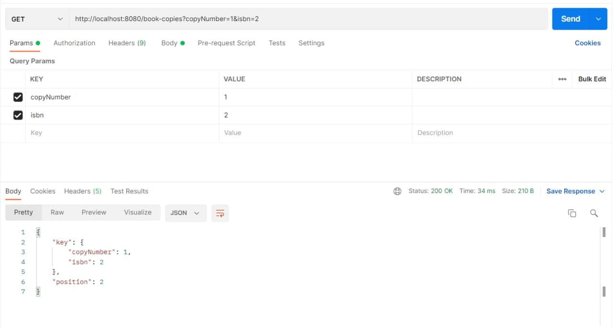

### Rent

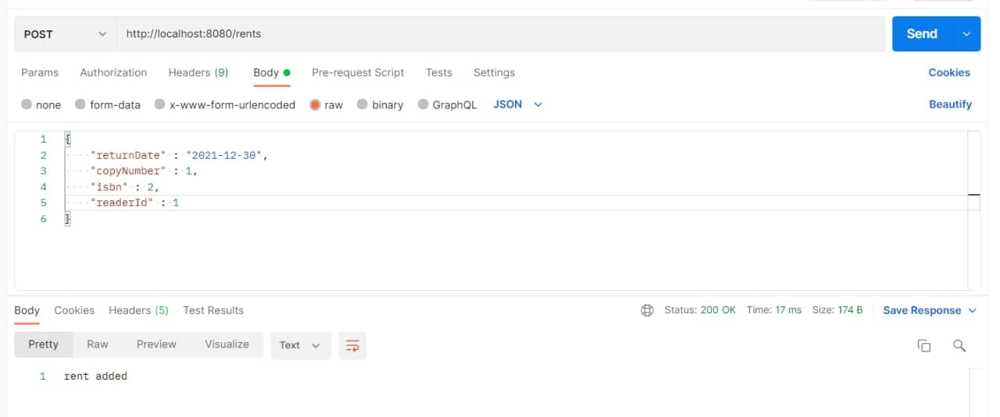

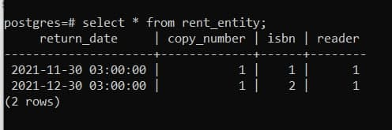

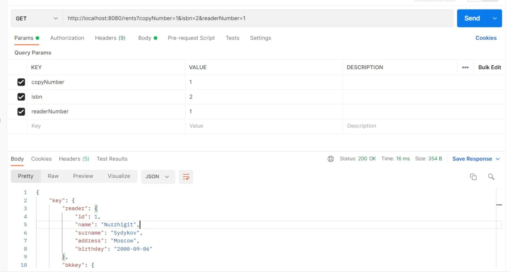
Ответ
```json
{
    "key": {
        "reader": {
            "id": 1,
            "name": "Nurzhigit",
            "surname": "Sydykov",
            "address": "Moscow",
            "birthday": "2000-09-06"
        },
        "bkkey": {
            "key": {
                "copyNumber": 1,
                "isbn": 2
            },
            "position": 2
        }
    },
    "returnDate": "2021-12-30"
}
```
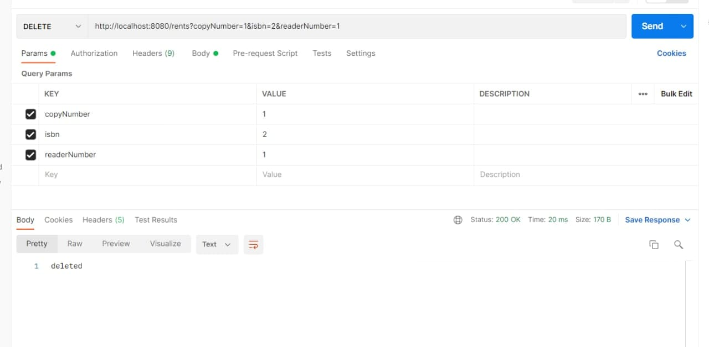

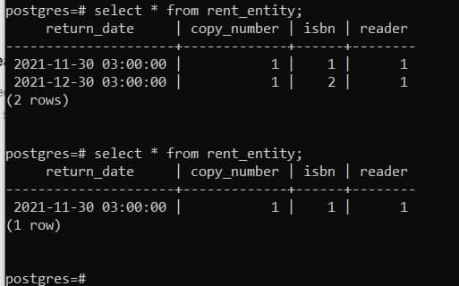

Создал только 3 сущности, так как это занимает много времени.
Нужно указать пароль к бд в файле application.properies в паке resoures.


